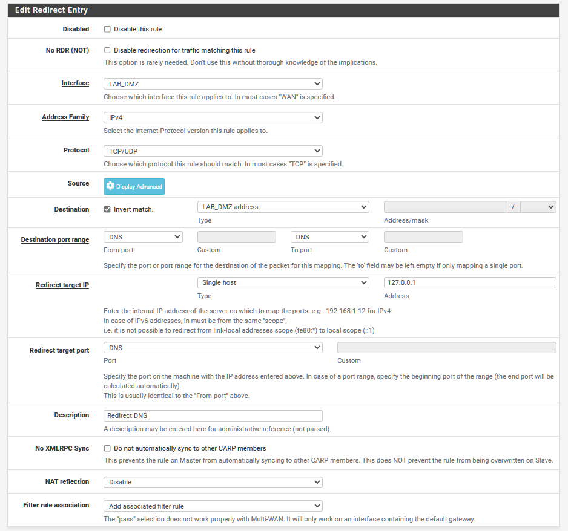
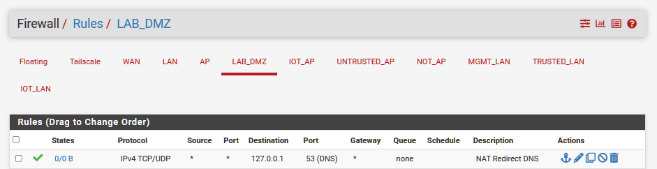

Source by DATApush3r: https://www.youtube.com/watch?v=2g0VoMrJA5c
- 2020 pfSense 2.4 DNS Redirect Tutorial: Completely control DNS on your network

## Step 1 configure default upstream DNS for whole network

System > General Setup > DNS server

1.1.1.1
9.9.9.9

## Step 2 configure DNS resolver to use forwarding mode

Service > DNS Resolver > General Settings

Enable Forwarding Mode [/] - enabled

## Step 3 configure NAT for the LAN network

Firewall > NAT

## Step 4 configure Firewall rule for LAB_DMZ

Firewall > Rules > LAB_DMZ

Move the DNS redirect to the most top

