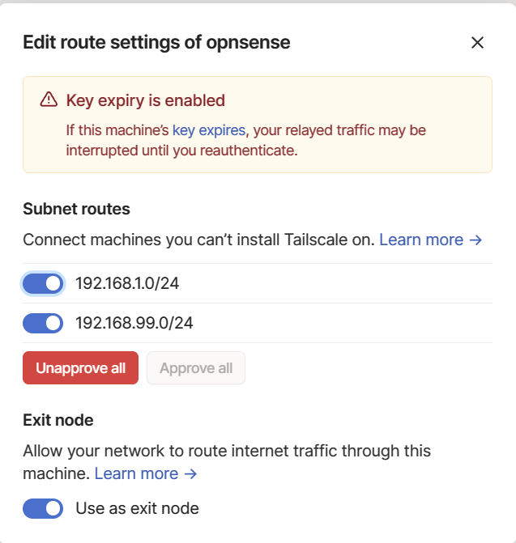

# Reference

[Official Install Instruction](https://tailscale.com/kb/1097/install-opnsense/)

# Post-installation step

## Step 1 Introduce subnet route and exit node

tailscale up --advertise-routes=192.168.1.0/24,192.168.99.0/24,10.0.0.0/8 --advertise-exit-node

## Step 2 Approve those subnet route from GUI and enable exit node

# reference

https://docs.opnsense.org/manual/software_included.html

https://www.youtube.com/watch?v=XXx7NDgDaRU